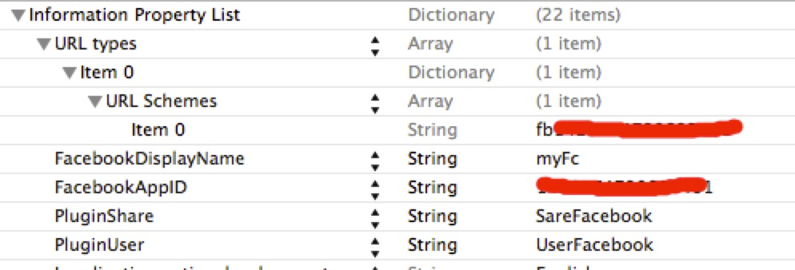

#Integrate Facebook SDK Beta for Cocos2d-JS on iOS

This document will walk you through the integration of Facebook SDK Beta for Cocos2d-JS.
 
**Notice**: Facebook SDK Beta for Cocos2d-JS can only work with Cocos2d-JS v3.0 RC2 and later versions. 

## Create your Facebook application

Facebook SDK Beta for Cocos2d-JS is based on the official Facebook iOS SDK on iOS, first of all, you need to refer to the [Facebook iOS Startup Guide](https://developers.facebook.com/docs/ios/getting-started/) to create a Facebook application.

## Integrate Facebook iOS SDK into your project

Open your project's Xcode project file (assuming the project is named `myProject`), we can find the it under `myProject/frameworks/runtime-src/proj.ios_mac/`.

1. Add Facebook iOS SDK: Find `FacebookSDK.framework` under `myProject/frameworks/js-bindings/cocos2d-x/plugin/plugins/proj.ios/sdk/`, add it to `Link Binary With Libraries`: Click on the project root, then `target`->`myProject IOS`->`Build Phases`->`Link Binary With Libraries`. At last click `+` button to add `FacebookSDK.framework` into the list.

2. According to Facebook official iOS startup guide, add `FacebookAppID` `FacebookDisplayName` `URL types` informations of your Facebook application into the `Info.plist` file. You can find this file under `ios` folder of your Xcode project. You can see the result in this image:<br/><br/>


3. Add two more items into the Info.plist file: `PluginShare`->`ShareFacebook` and `PluginUser`->`UserFacebook`, you can see the result in the image above.

4. Find `ios/AppController.mm`, add necessary code for Facebook iOS SDK:

- Add header of Facebook iOS SDK `FacebookSDK/FacebookSDK.h`:

	```
	#import <FacebookSDK/FacebookSDK.h>
	```

- Add the following method in `AppController.mm`: 

	```
	- (BOOL)application:(UIApplication *)application openURL:(NSURL *)url sourceApplication:(NSString *)sourceApplication annotation:(id)annotation
	{
	    return [FBSession.activeSession handleOpenURL:url];
	}
	```

- Add `[FBAppCall handleDidBecomeActive];` in `applicationDidBecomeActive:` function: 

	```
	- (void)applicationDidBecomeActive:(UIApplication *)application {
	    [FBAppCall handleDidBecomeActive];
	    cocos2d::Director::getInstance()->resume();
	}
	```

## Add Plugin-x and PluginFacebook into your project

As `Facebook SDK Beta for Cocos2d-JS` is based on Plugin-x, we need to add Plugin-x project to your project first.

1. Add PluginProtocol's Xcode project (under `myProject/frameworks/js-bindings/cocos2d-x/plugin/protocols/proj.ios`) into your Xcode project as a sub project: right click on `myProject`, then choose `addFiles to "myProject"` to add it or drag the PluginProtocol project directly under `myProject`.

2. Add PluginFacebook's Xcode project（under `myProject/frameworks/js-bindings/cocos2d-x/plugin/plugins/facebook/proj.ios`）into your Xcode project as a sub project: right click on `myProject`, then choose `addFiles to "myProject"` to add it or drag the PluginFacebook project directly under `myProject`.

3. Add libraries into build phases: click on `myProject`, then `target`->`myProject IOS`->`Build Phases`, click `+` button of `Link Binary With Libraries` list to add `libPluginProtocol.a` and `libPluginFacebook.a`.

## Add Plugin-x for JSB

After previous steps, we can use FacebookAgent class which encapsulated all Facebook SDK Beta's C++ level APIs. But there are some more steps to make it available for Javascript code, we need to include and register the Javascript bindings code in SpiderMonkey.

1. Add jsb_pluginx.js (under `myProject/frameworks/js-bindings/cocos2d-x/plugin/jsbindings/script`) into `myProject`, and make sure it's listed in `Build Phases`'s `Copy Bundle Resources`.

2. Find `Classes` folder, add Javascript bindings related header files in `AppDelegate.cpp`, there are two header files: `jsb_cocos2dx_pluginx_auto.hpp` and `jsb_pluginx_extension_registration.h`.

    ```
	#if (CC_TARGET_PLATFORM == CC_PLATFORM_IOS || CC_TARGET_PLATFORM == CC_PLATFORM_ANDROID)
		#include "jsb_cocos2dx_pluginx_auto.hpp"
		#include "jsb_pluginx_extension_registration.h"
	#endif
    ```

3. Register Javascript bindings code in `AppDelegate::applicationDidFinishLaunching`function of `AppDelegate.cpp`, as showing below:

    ```
	#if (CC_TARGET_PLATFORM == CC_PLATFORM_IOS || CC_TARGET_PLATFORM == CC_PLATFORM_ANDROID)
		sc->addRegisterCallback(register_all_pluginx_protocols);
		sc->addRegisterCallback(register_pluginx_js_extensions);
	#endif
    ```

Our PluginFacebook project is now ready for use in C++, if you want to know more details about Plugin-x, please refer to [Plugin-x Architecture](http://www.cocos2d-x.org/docs/manual/framework/html5/jsb/plugin-x/plugin-x-architecture/en) and [Integrate Plugin-x on iOS]().

## How to Use Facebook SDK Beta

About how to use Facebook API please reference to [Facebook SDK Beta for Cocos2d-JS](../api-reference/en.md)